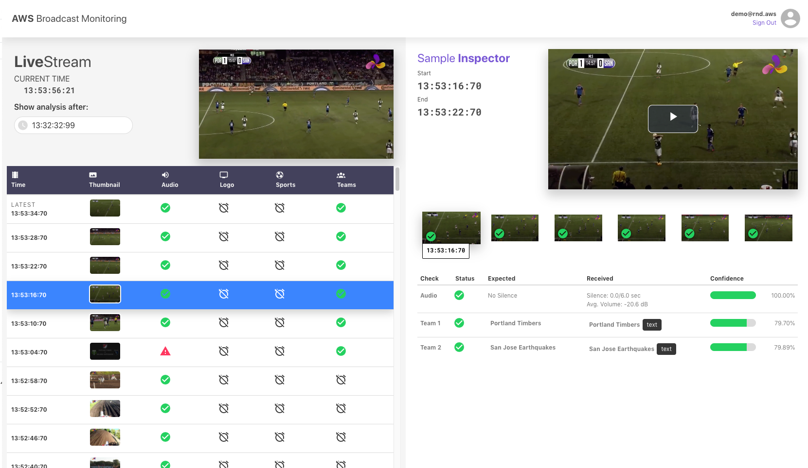
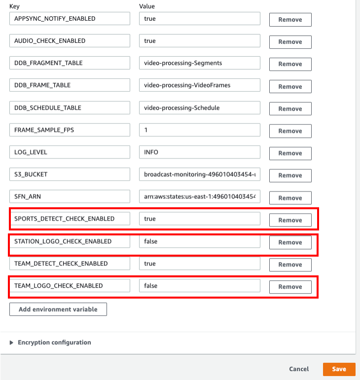

# Automating broadcast video monitoring using machine learning - blog post and sample application

In the M&E industry, monitoring live broadcast and OTT video streams has largely been a manual process relying on human operators constantly watching the stream to identify quality or content issues. Latest advances in artificial intelligence(AI) can help automate many monitoring tasks that was once manual and support monitoring at greater scale. This repo presents a demo application for realtime livestream monitoring using AWS serverless and AI/ML services.

Read more on the accompanying [blog post](https://aws.amazon.com/blogs/media/automate-broadcast-video-monitoring-using-machine-learning-on-aws/).

- [Architecture](#architecture)
- [Deploying the application in your AWS account](#deploying-the-application-in-your-aws-account)
  - [Deploying the video ingestion pipeline and video processing pipeline](#deploying-the-video-ingestion-pipeline-and-video-processing-pipeline)
    - [Option 1: One-click deployment](#option-1--one-click-deployment)
    - [Option 2: build from source](#option-2--build-from-source)
  - [Deploying the web app](#deploying-the-web-app)
- [Running the application](#running-the-application)
  - [Running the app without custom Rekognition models](#running-the-app-without-custom-rekognition-models)
  - [Running the app with custom models trained with Amazon Rekognition](#running-the-app-with-custom-models-trained-with-amazon-rekognition)
- [Stoping the application](#stoping-the-application)
- [Clean up](#clean-up)
- [Reporting security issues](#reporting-security-issues)
- [License](#license)

<small><i><a href='http://ecotrust-canada.github.io/markdown-toc/'>Table of contents generated with markdown-toc</a></i></small>

## Architecture

The solution architecture for the application consists of three main components:

- A video ingestion pipeline where HLS streams produced by AWS Elemental MediaLive is stored in an Amazon S3 bucket
- A video processing pipeline orchestrated by AWS Step Functions that performs monitoring checks on extracted frames and audio from each video segment
- A web application that demonstrates the realtime status and details of each monitoring check being performed on the video stream


## Deploying the application in your AWS account

### Deploying the video ingestion pipeline and video processing pipeline

This section discuss how to deploy the Video ingestion and processing pipeline component of the sample application

#### Option 1: One-click deployment

Follow the below for a quick way to deploy the sample pipeline.

1. Using the following button to start launching a CloudFormation stack:

   [](https://console.aws.amazon.com/cloudformation/home?region=us-east-1#/stacks/new?stackName=broadcast-monitoring&templateURL=https://s3.amazonaws.com/broadcast-monitoring-blog/cloudformation/backend.yml)

1. Select the **Next** button to continue
1. In **Step 2: Specify stack details** review the stack parameters.
   These settings configures the source of the HLS stream the AWS Elemental MediaLive pipeline will be producing and monitored by the application. Keep the default to generate a test stream using a sample mp4 file hosted on S3. You can change these settings at this point to to point to your own video files/streams.

   Once the stack is created, you can also change the input configuration any time by doing so in the AWS Elemental MediaLive console (The AWS Elemental MediaLive pipeline allows switching between different input sources seamlessly as long as you stop the pipeline before making changes)

1. Click the **Next** button. In **Step 3 Configure stack options** page, keep all defaults, and click **Next** again
1. In **Step 4 Review** page, click the checkmarks to acknowledge CloudFormation will be creating IAM resources and the `CAPABILITY_AUTO_EXPAND` capability, and then click “**Create stack**”.
1. Wait for the stack creation to complete

#### Option 2: build from source

If you would like to develop on top of the application and make changes, you can also build and deploy the application from source

1. Fork the repo
2. clone to local workspace using `git clone`
3. Source code for the Video ingestion and processing pipeline components is under `broadcast-monitoring` subdirectory. Navigate to the directory:

   ```
   cd broadcast-monitoring/
   ```

4. initialize pipenv

   ```
   pipenv install
   ```

5. In the `Makefile`, fill in your own S3 bucket name in `ARTIFACTS_BUCKET=<your-s3-bucket>` to be used for packaging Lambda code
6. Run the make targets to build and deploy the processing pipeline.

   ```
   pipenv run make	build.processing
   pipenv run make	deploy.processing
   ```

   This will create:

   - A S3 bucket
   - A Step Functions state machine,
   - A Lambda function that starts the Step Functions state machine when the S3 bucket has a new manifest file
   - DynamoDB tables to store schedule metadata and media analysis results

7) After the processing pipeline finish deploying , build and deploy the media ingest pipeline:

   ```shel
   pipenv run make build.mediaingest
   pipenv run make deploy.mediaingest
   ```

   This will create:

   - An AWS Elemental MediaLive channel with a MediaLive input (configured by the CloudFormation input parameters)
   - An AWS Elemental MediaPackage channel connected to the MediaLive channel
   - A CloudFront distribution connected to the MediaPackage channel

### Deploying the web app

To examine and visualize the results of the monitoring checks, we developed a demo web application using AWS Amplify, AWS AppSync and VueJS. The web app frontend uses a GraphQL subscription over web sockets to receive updates on the latest analysis of each HLS media segment. When the user clicks on a specific segment to see more detailed results, they can inspect the information extracted vs the expected for each sampled frame and confidence scores of each evaluation. They can also replay the video of selected segment, powered by Elemental MediaPackage’s [time-shifted viewing](https://docs.aws.amazon.com/mediapackage/latest/ug/time-shifted.html) feature.

To deploy the web app using the Amplify Console:

1.  Fork this GitHub Repo
1.  Go the [Amplify Console](https://console.aws.amazon.com/amplify/home), click “**Connect App**”, then select “**GitHub**” option and click the **continue** button

1.  If you haven’t already, Amplify console will walk you through connecting to your GitHub account.
1.  In the **Add repository branch** page, select the repo you just forked.

    - Tick the checkmark for “_Connecting a monorepo? Pick a folder_.”
    - Type in `broadcast-monitoring-ui` for the folder that contains the webapp
      

1.  In the **Configure build settings** page:

    - Make sure the checkmark for “_Deploy updates to backend resources with your frontend on every code commit_” is selected
    - Under “Select a backend environment”, choose “**create a new environment**”. This will create necessary resources that supports the web app, such as the AppSync graphQL API and Cognito User Pools to manage login.
    - If you don’t already have an Amplify service IAM role, follow the wizard to create one. Otherwise, select an existing role.
    - keep rest of the values as default, and click **Next**

      

1.  In the **Review** page, double check the configurations before clicking **Save and Deploy**

    

1.  Wait for the web app to finish deployment.

    

1.  We need to do one more configuration to link the processing pipeline to the web application. To do this:

    - In the Amplify application, go to the “**Backend environments**” tab
    - Click on the “**API**” link under “**categories added**”
    - Then click on “**View in AppSync**” to go to the AWS AppSync console
    - In the Settings tab, find the **API Details** section and copy the **API URL**
      

    - Also copy the API key from the **API Keys** section
      

    - Go to the [AWS Lambda console](https://console.aws.amazon.com/lambda/home), find the lambda function with name “_AppSyncNotify_” in it. Edit the environment variable by pasting the GraphQL API URL and Key you copied from previous step, and click **save**

      

## Running the application

Once you have deployed the video ingestion and processing pipeline using CloudFormation and the web application using the Amplify Console, you are ready to start running the sample application.

**Note:** Because several features of the sample application (sports detection, logo detection, etc.) relies on Custom Models built in Amazon Rekognition, **they are not enabled by default**.

### Running the app without custom Rekognition models

1. Populate the expected programming schedule table ( `video-processing-Schedule` table) in DynamoDB. Use the provided script and sample schedule if you are using the test source video provided. If using your own video, adjust the content accordingly.

   ```
   cd broadcast-monitoring
   pipenv run python scripts/load_csv_to_ddb.py scripts/schedule.csv video-processing-Schedule
   ```

1. In the DynamoDB console, verify the `video-processing-Schedule` table is populated

1. Start the media processing pipeline. This is done by simply going to the [Elemental MediaLive console](https://console.aws.amazon.com/medialive/home?region=us-east-1), start the MediaLive channel created by the CloudFormation stack to kick off the HLS stream production.

   

1. Go to the [AWS Amplify console](https://console.aws.amazon.com/amplify/home?region=us-east-1), find the URL of the web application and open the web app in Chrome or Firefox.

1. Register an account using your email. After verifying your email with a verification code, you should be able to log in to the web app.

1. Here's an example screenshot of the web app when the features requiring custom models are disabled:

   

### Running the app with custom models trained with Amazon Rekognition

1. To supply your own Amazon Rekognition Custom Labels model for **sports detection**, go to the AWS Lambda console and find the function with name containing `SportsDetectFunction`. Edit the environment variable for the function by updating the value for the `SPORTS_MODEL_ARN` variable to the ARN of your Amazon Rekognition Custom Labels model.

1. To supply your own Amazon Rekognition Custom Labels model for **station logo detection**, go to the AWS Lambda console and find the function with name containing `LogoDetectionFunction`. Edit the environment variable for the function by updating the value for the `LOGO_MODEL_ARN` variable to the ARN of your Amazon Rekognition Custom Labels model.

1. To supply your own Amazon Rekognition Custom Labels model for **team logo detection**, go to the AWS Lambda console and find the function with name containing `LogoDetectionFunction`. Edit the environment variable for the function by updating the value for the `LOGO_MODEL_ARN` variable to the ARN of your Amazon Rekognition Custom Labels model.

1. Ensure the Amazon Rekognition Custom Labels model is up and running.

1. To enable the corresponding features, go to the AWS Lambda console and find the function with name containing `StartSfnFunction`. Edit the environment variable and make sure the feature you want enabled is set to `true`. When the feature is set to `false`, the corresponding Lambda function will skip running its function code.

   

## Stoping the application

To stop the processing pipeline, simply go to the [Elemental MediaLive console](https://console.aws.amazon.com/medialive/home?region=us-east-1), and select the running the MediaLive channel and select the **Stop** action

When the MediaLive channel is stopped, no more new writes will go to the S3 bucket and no Step Functions workflow will be triggered.

## Clean up

To remove the deployed infrastructure from your account:

1. Go to AWS CloudFormation console, delete the root stack for backend resources for Amplify web app with name starting with `amplify-broadcast`

1. Delete the stack for the media ingestion and processing pipeline `broadcast-monitoring`

1. Go to the AWS Amplify console and delete the web app.

## Reporting security issues

See [CONTRIBUTING](CONTRIBUTING.md#security-issue-notifications) for more information.

## License

This library is licensed under the MIT-0 License. See the LICENSE file.
